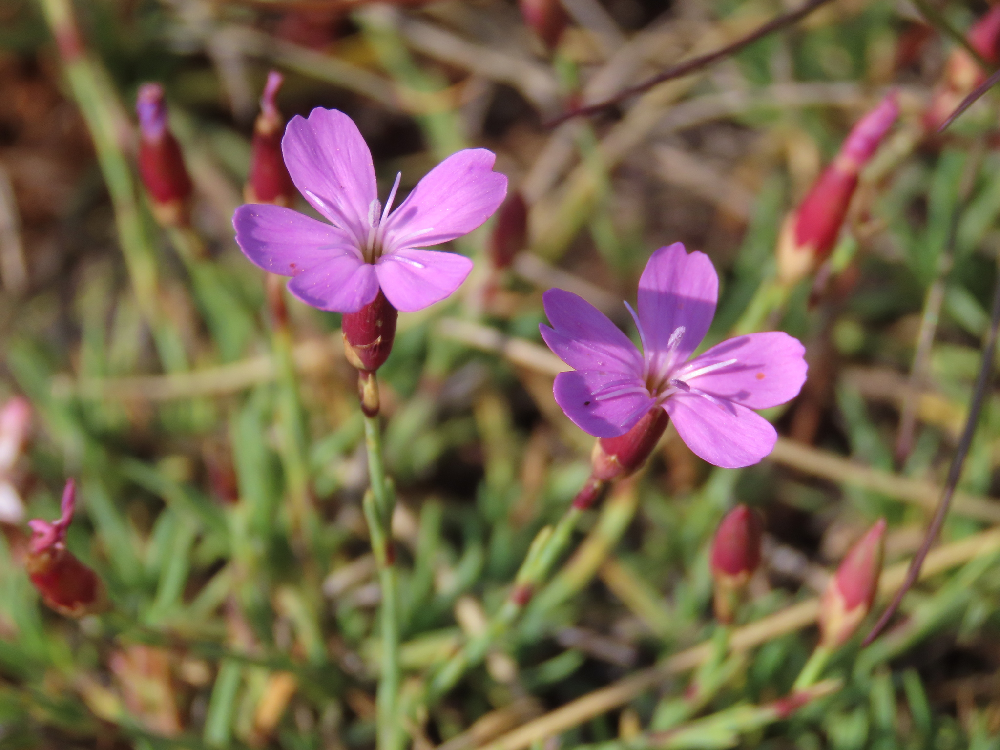

```{r setup, include=FALSE}
knitr::opts_chunk$set(echo = TRUE)
```

[



# Functional intraspecific variation in the base water potential for seed germination along soil microclimatic gradients

This repository stores all the information related to the manuscript [*Functional intraspecific variation in the base water potential for seed germination along soil microclimatic gradients*](http://doi.org/10.1111/1365-2435.14754), including the raw datasets, the scripts to perform data cleaning, analysis and figures. 

## Contents

This repository is organised following the advice of [Wilson et al. 2017](https://doi.org/10.1371/journal.pcbi.1005510) for recording and storing research projects.


The following materials are available in the folders of this repository:

* `data` Data files including the 
[Dianthus raw germination data](https://github.com/clara-espinosa/Dianthus_PEG/blob/main/data/dianthus_germ_data.csv),
[Subpopulations environmental data included in the study](https://github.com/clara-espinosa/Dianthus_PEG/blob/main/data/Dianthus_header.csv), 
[Individal Dianthus seed weigths at each subpopulation](https://github.com/clara-espinosa/Dianthus_PEG/blob/main/data/ind_seeds_weight.csv),
bioclimatic data;  [Temperature and Water potential 4 year records or the study area](https://github.com/clara-espinosa/Dianthus_PEG/blob/main/data/wp_villa_2020_2024.csv) as well as 
[iButtons registered temperatures foer each subpopulation](https://github.com/clara-espinosa/Dianthus_PEG/blob/main/data/temperature_ibuttons.csv) 
It also includes the [Subpopulations coordinates table](https://github.com/clara-espinosa/Dianthus_PEG/blob/main/data/ibuttons%20plots%20coordinates.csv).
* `doc` Manuscript submitted to Functional Ecology.
* `results` Output of the `R` scripts, including figures, tables and supplementary information.
* `src` Scripts in `R` language used to clean the raw data, perform the analyses of the manuscript and create the figures.

## Abstract

* **Background** The ability of plants to successfully regenerate depends on complex physiological and ecological processes, and one of the first vital stages is seed germination, which depends on temperature, light and water availability. Within species variation in seed germination allows differential responses when facing stimuli and is key for adaptation in the natural world. There has been abundant research about variation in germination responses to temperature changes, but much less is known about responses to water availability, specifically the limits and the potential variation within a single wild species. Under ongoing climate change with increasing drought episodes it is vital to know the minimum amount of water required for germination, as well as if variation and therefore the potential to adapt exists within a species.     
* **Methods** We focused on a wild carnation (Dianthus langeanus) endemic to the northwestern Iberian Peninsula. We collected seeds from 18 different subpopulations, some only 10 m apart, and with contrasting microclimatic conditions due to topography, slope and orientation. We measured germination responses to water stress using polyethylene glycol (PEG) solutions, a polymer that increases water density and allows to mimic different drought intensities.

* **Key Results**  We found considerable differences in germination under water stress between each subpopulation. Seeds from warmer and drier subpopulations were able to germinate under higher water stress, meaning their germination was more drought tolerant.

* **Synthesis** Our results highlight the importance of germination responses to water availability. Variation within species appears to be important even at small scales, suggesting an important previously unknown potential for seed germination adaptation to future drier conditions.

## Citation

Please cite the repository, datasets and article as: Espinosa del Alba, C., Cruz-Tejada, D., Jiménez-Alfaro, B., and E. Fernández-Pascual. (2025).Functional intraspecific variation in the base water potential for seed germination along soil microclimatic gradients. Functional Ecology. DOI :10.1111/1365-2435.14754.
